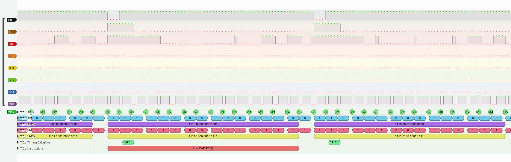
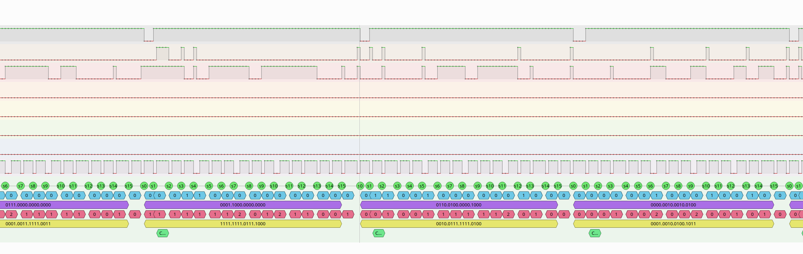

## TI5x (TI59, TI58, TI58C) pocket calculator decoder
My try to have a Sigrok based decoder for signals from the venerable
pocket calculators made by texas Instruments. 

Useful signals: 4 bit data bus, IDLE, EXT, IRG, PHI1.

Some signals are available at the library module slot:
* IDLE, EXT, IRG, PHI1
* GND (I use Vdd for that together with my KingST LA5032 Logic Analyzer)

4 bit data bus is only available at the chip pins after removing the 
back of the TI housing.

Two example view of some early version of the decoder. Several instruction 
cycles are shown. LA was used with 1 MS/sec and 5 MS/sec.





## How to install the decoder
On startup, sigrok and pulseview look in several directories for decoders.

On Linux for example, the local user directory that can contain custom
decoders is located at ```$HOME/.local/share/libsigrokdecode/decoders```
Check Pulseview/Sigrok documentation for required location on other operating
systems.

Create a new directory ```ti5x``` in the mentioned directory and copy all files
from this repository to that directory, e.g. into ```$HOME/.local/share/libsigrokdecode/decoders/ti5x```
(Absolutely required files are: __init__.py and pd.py)

## How to use the decoder
After installation part described avove, restart Pulseview. 

It should now offer the new decoder in the decoder section "Retro computing".

If you have named the Pins 0..7 with correct names (IDLE, EXT, IRG, IO8, IO4,
IO2, IO1, PHI1), Pulseview will connect these pins directly to the decoder
inputs and decoding will start.


## TODOs
* IO-lines processing not yet done

## Documentation
* [Calculators TI–58/59 HW programming guide, by Hynek Sladky](docs/TI_58_59-HW-manual.pdf). This 
  document contains also instruction code tables
* [TI PC-100A Interface Description](docs/TI_Calculator_Printer_Interface.pdf). Original
  document by Texas Instruments from 1978. Explains software/hardware protocol
  in detail, with focus on printer cradle.

## Patents
4153937	TI-59	 	1977	Microprocessor system having high order capability

All patents that had been used are listed here: http://www.datamath.org/Patents.htm

