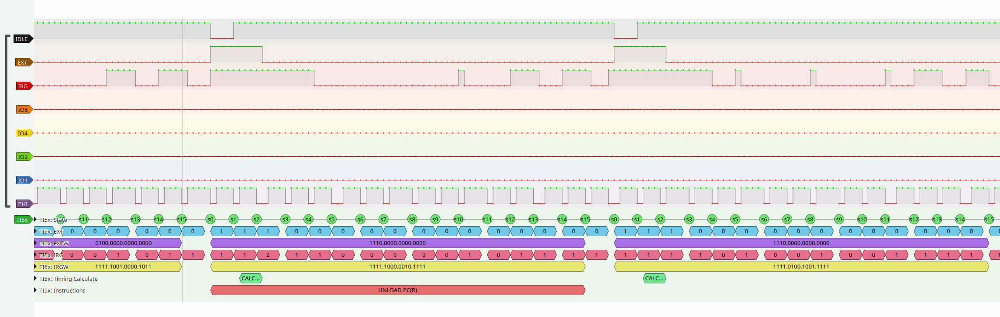
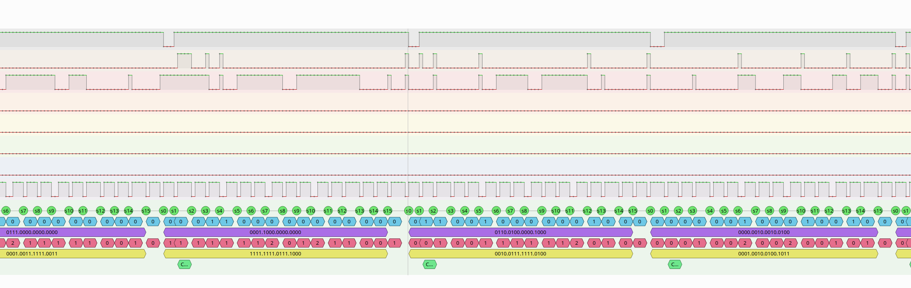

## TI5x (TI59, TI58, TI58C) pocket calculator decoder
My try to have a Sigrok based decoder for signals from the venerable
pocket calculators made by texas Instruments. 

Useful signals: 4 bit data bus, IDLE, EXT, IRG, PHI1.

Some signals are available at the library module slot:
* IDLE, EXT, IRG, PHI1
* GND (I use Vdd for that together with my KingST LA5032 Logic Analyzer)

4 bit data bus is only available at the chip pins after removing the 
back of the TI housing.

Two example view of some early version of the decoder. Several instruction 
cycles are shown. LA was used with 1 MS/sec and 5 MS/sec.

## TODOs
* IO-lines processing not yet done
* Instructions are only partially decoded to mnemonics

## Documentation

## Patents
4153937	TI-59	 	1977	Microprocessor system having high order capability
